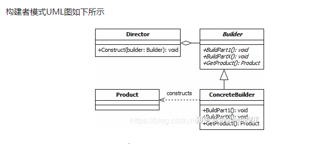

如上图所示，builder模式有4个角色。

- Product: 最终要生成的对象，例如 Computer实例。
- Builder： 构建者的抽象基类（有时会使用接口代替）。其定义了构建Product的抽象步骤，其实体类需要实现这些步骤。其会包含一个用来返回最终产品的方法Product getProduct()。
- ConcreteBuilder: Builder的实现类。
- Director: 决定如何构建最终产品的算法. 其会包含一个负责组装的方法void Construct(Builder builder)， 在这个方法中通过调用builder的方法，就可以设置builder，等设置完成后，就可以通过builder的 getProduct() 方法获得最终的产品。
> 可以看到，文章最开始的使用方式是传统builder模式的变种， 首先其省略了director 这个角色，将构建算法交给了client端，其次将builder 写到了要构建的产品类里面，最后采用了链式调用。